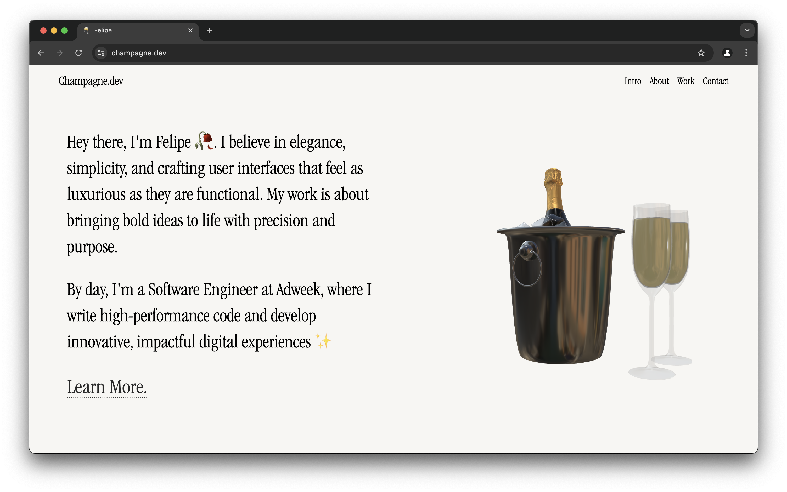

# 🍾 champagne.dev – Personal Portfolio

**champagne.dev** is my personal portfolio site, built with **React, Tailwind CSS, and Babylon.js**. It showcases my work, projects, and thoughts on web development with an elegant, minimal design.

## Tech Stack

- **Frontend:**

  - **ReactJS** – Dynamic, fast, and what all the cool kids are using.
  - **Tailwind CSS** – For sleek, responsive styling.
  - **Framer Motion** – Smooth animations and UI interactions.

  - **Babylon.js** – 3D spinning champagne bottle animation.  
    _(Couldn’t get the lighting how I wanted in Three.js—skill issue on my part)_

- **Hosting & Deployment:**
  - **Cloudflare Pages** – Shoutout to Cloudflare for lightning-fast & **_free_**

## Features

- **Interactive 3D Animation** – An interactive champagne bottle spins on the top using Babylon.js.
- **Minimal & Elegant UI** – Designed with a clean, modern aesthetic using Tailwind CSS.
- **Blog Component** – Markdown-powered content blog inspired by Daring Fireball. _(still a work in progress so coming soon!)_
- **Optimized for Speed** – Using Next.js and Cloudflare Pages for performance.

## Demo

[visit champagne.dev](https://champagne.dev)



## Installation & Setup

Clone the repo and install dependencies:

```sh
git clone https://github.com/openchampagne/champagne.dev.git
cd champagne.dev
npm install
```

### Development

To start a local development server, run:

```sh
npm run dev
```

### Production Build

To build the project for production and start the server, run:

```sh
npm run build
npm run start
```

### License

This project is licensed under the Apache License 2.0.
You are free to use and modify it, but please credit me by linking to [champagne.dev](https://champagne.dev).
